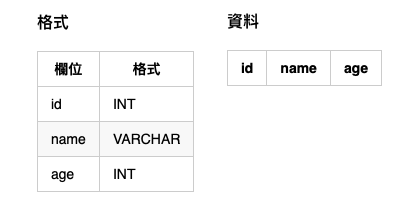

# create

## 情境
### 資料庫


<!--
#### 格式
| 欄位 | 格式  |
|---|---|
| id | INT |
| name | VARCHAR |
| age | INT |

#### 資料
| id | name | age |
|---|---|---|
-->

### Model

```php
namespace App\Model;

class User extends \Orm\Model {}
```

## 普通新增

新增成功則回傳該 **Model 物件**，失敗則回傳 **null**

```php
$user = \App\Model\User::create([
  'name' => 'OA',
  'age' => 18,
]);

if ($user) {
  echo $user->id; // 1
  echo $user->name; // OA
  echo $user->age; // 18
} else {
  var_dump($user); // null
}
```

## 多筆新增
全部皆新增成功則回傳 **數量**，只要有一筆失敗則回傳 **null**，下面例子雖然新增了兩筆資料，但其實只下了一次 Query

```php
$datas = [];
array_push($datas, [
  'name' => 'OA'
  'age' => 18,
]);
array_push($datas, [
  'name' => 'OB'
  'age' => 28,
]);

$count = \App\Model\User::creates($datas);
echo $count === 3 ? '成功新增' . $count . '筆資料' : '新增失敗';
```

如果資料太多，想要分批新增，可以在**第二參數**決定多少筆數為一批，下列範例是以每 10筆為一批去執行，以下面例子共有 26 筆資料，若採用 10筆分批，則會 **下 3 次 Query**
成功即回傳 **筆數**，失敗則 **null**。

```php
$datas = [
  ['name' => 'OA', 'age' => 18],
  ['name' => 'OB', 'age' => 28],
  // ... N 筆資料
  ['name' => 'OY', 'age' => 31],
  ['name' => 'OZ', 'age' => 26],
];

$count = \App\Model\User::creates($datas, 10);
echo $count !== null ? '成功新增' . $count . '筆資料' : '新增失敗';
```

第三個參數則為選擇哪一個 DB，預設為 Config 設定中的第一個 DB，若要指定其他 DB，則可以帶入 DB 名稱。

```php
$count = \App\Model\User::creates($datas, 10, 'db2');
```

## 新增之後
此功能只給 **普通新增** 使用！

如果每次新增一筆 User 資料時，都需要在 name 欄位加入 `'Suffix_'` 字串，那就可以在 `afterCreates` 內指定一個新增完後需要做的 method，如果 `afterCreates` 中若有一個回傳不是為 true，那此次新增就會是失敗的，該 create 即回傳 **false**。

通常這類功能可以用在 **計數** 功能的欄位上。

`afterCreates` 不保證成功全跑完，失敗結束不影響新增。中間有一次斷掉後，後面的則不會做完。

```php
// 定義 Model
class User extends Model {
  static $afterCreates = ['addSuffix'];

  public function addSuffix() {
    $this->name = 'Suffix_';
    $this->save();
    return true;
  }
}

// 新增一筆
$user = \App\Model\User::create([
  'name' => 'OA',
  'age' => 18
]);

if ($user) { // 新增成功
	echo $user->name; // Suffix_OA
}
```
