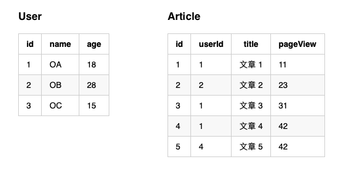
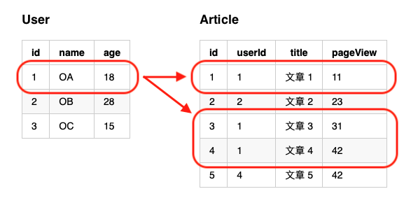
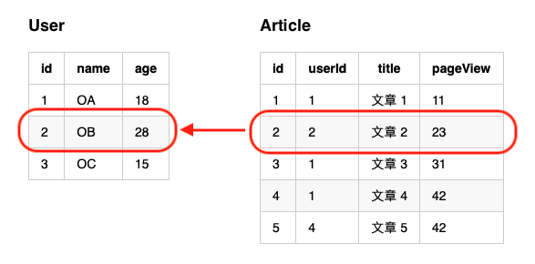
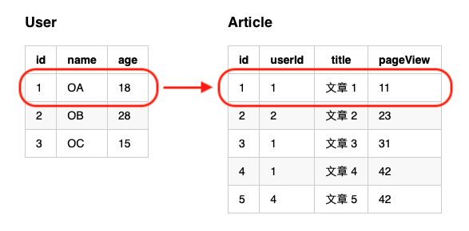
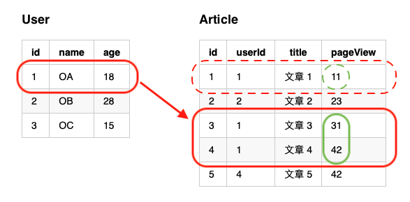

# relation
關聯

## 情境
### 資料庫


<!--
### User
| id | name | age |
|---|---|---|
| 1 | OA | 18 |
| 2 | OB | 28 |
| 3 | OC | 15 |

### Article
| id | userId | title | pageView |
|---|---|-------|-----------|
| 1 | 1 | 文章 1 | 11 |
| 2 | 2 | 文章 2 | 23 |
| 3 | 1 | 文章 3 | 31 |
| 4 | 1 | 文章 4 | 42 |
| 5 | 4 | 文章 5 | 42 |
-->

### Model

```php
namespace M;

class User extends Model {}

class Article extends Model {}
```

## hasMany
因為關聯式資料庫經常需要做資料關聯，時常遇到 `一對一` 或 `一對多` 甚至 `多對多` 的關聯模式，而此系統也提供了方便的關聯方式。

以下範例，單筆 `User`，需要取出其所屬的 `Article` 情境：



```php
$user = \M\User::one(1);
$articles = \M\Article::all('userId = ?', $user->id);

foreach ($articles as $article) {
  echo $article->title;
  // 依序會印出 "文章 1"、"文章 3"、"文章 4"
}

$user = \M\User::one(3);
$articles = \M\Article::all('userId = ?', $user->id);
echo count($articles); // 0
```

但若使用了 `hasMany` 關聯方式，則會簡潔許多！

方式就是在 `User Model` 內新增一個回傳 `hasMany` 的函式，如下範例：

```php
class User extends Model {
  public function articles() {
    return hasMany(Article::class);
  }
}
```

上例 `User Model` 內建立一組**關聯函式**，語意就是 `User` 有著**多筆**的關聯，單筆 `User` 對應著多筆的 `Article`。

由於資料表 `Article` 中有 `userId` 外鍵作為與 `User` 的 `id` 主鍵做關聯，系統就會依據命名方式自動對應：

```php
$user = \M\User::one(1);
foreach ($user->articles as $article) {
  echo $article->title;
  // 依序會印出 "文章 1"、"文章 3"、"文章 4"
}

$user = \M\User::one(3);
echo count($user->articles); // 0
```

## belongToOne
`belongToOne` 的思維就與 `hasMany` 相反，`belongToOne` 則是在 `Article` 角度思考，單筆 `Article` 資料，取得其所屬的 `User`。

以下範例，單筆 `Article`，需要取出其所屬的 `User` 情境：



```php
$article = \M\Article::one(2);
$user = \M\User::where('id', $article->userId)->one();
echo $user->name; // OB

$article = \M\Article::one(5);
$user = \M\User::where('id', $article->userId)->one();
var_dump($user); // null
```

但若使用了 `belongToOne` 關聯方式，會簡潔許多，方式與 `hasMany` 相似，就是在 `Article Model` 內新增一組 **關聯函式**，如下範例：

```php
class Article extends Model {
  public function user() {
    return belongToOne(User::class);
  }
}
```

`Article Model` 內建立一組**關聯函式**，語意就是 `Article` 有著**單筆**的關聯，單筆 `Article` 對應著單筆的 `User`。

由於資料表 `Article` 中有 `userId` 外鍵作為與 `User` 的 `id` 主鍵做關聯，系統就會依據命名方式自動對應：

```php
$article = \M\Article::one(2);
echo $article->user->name; // OB

$article = \M\Article::one(5);
var_dump($article->user); // null
```

> `hasMany` 是一對多模式，故取出來的的值會是**多筆**的，所以是回傳 **Model 陣列**，若找不到任何資料則回 **空陣列**
> 
> 反之 `belongToOne` 是屬於某一筆資料，所以回傳結果會是 **Model 物件**，若找不到關聯則回傳 **null**


## hasOne
有 `hasMany` 就會有 `hasOne`，其邏輯與 `hasMany` 相似，差別是回傳結果會不同而已，`hasMany` 是回傳 **陣列**，而 `hasOne` 則是 **物件**。

`hasOne` 簡單說就是 `hasMany` 的第一筆資料，若 `hasMany` 結果為空陣列，那 `hasOne` 結果必為 **null**



```php
class User extends Model {
  public function article() {
    return hasOne(Article::class);
  }
}

$user = \M\User::one(1);
echo $user->article->title; // 文章 1

$user = \M\User::one(3);
var_dump($user->article); // null
```

## 條件關聯
關聯可以依據需求做其他條間查詢，例如需要取得該 `User` 下 `pageView` 超過 **20** 的 `Article`，在關聯模式下該如何做？

如下範例，可以使用**關聯函式**回傳值做條件增加，由於關聯函式執行完結果為一項 `SQL Builder` 故可以繼續增加條件。



```php
class User extends Model {
  public function articles() {
    return hasMany(Article::class);
  }
}

$user = \M\User::one(1);
$articles = $user->articles()->where('pageView', '>', 20)->all();
foreach ($articles as $article) {
  echo $article->title;
  // 依序會印出 ""文章 3"、"文章 4"
}
```

> **關聯函式** 若當變數執行，則直接下執行 SQL 查詢，如果是 `hasMany`、`belongToMany` 則回傳 **Model 陣列**，若是 `hasOne`、`belongTo` 則回傳 **Model 物件** 或 **null**。
> 
> 第二次執行 **關聯函式** 的變數時，則會快取上次的變數結果，故不會再下 SQL 查詢。
> 
> Ex.
> `var_dump($user->article);`
> `var_dump($user->article);`
> 
> 上例執行了兩次關聯函式，但因為是採用變數方式，故只會查詢一次 SQL。


## 關聯鍵

`hasMany`、`hasOne` 以及 `belongTo`、`belongToMany` 系統之所以可以自動關聯起來，主要是因為命名規則的統一。

如 `Article` 內有 `userId` 當外鍵，對應著 `User` 的 `id` 主鍵，所以可以自動的關聯起來，其完整的寫法應該是如下：

* 第一參數為需關聯的 Model
* 第二參數為 Foreign Key
* 第三參數為 Primary Key

```php
class User extends Model {
  public function articles() {
    return hasMany(Article::class, 'userId', 'id');
  }
}

class Article extends Model {
  public function user() {
    return belongToOne(User::class, 'userId', 'id');
  }
}
```

因為命名有符合 `駝峰式命名（CASE_CAMEL）` 所以系統允許可以不必每次都填寫 `primary` 與 `foreign` 的設定值，除非您的資料庫欄位名稱因為專案需求無法符合命名規則，那就必須定義清楚 `primary` 與 `foreign` 欄位。
