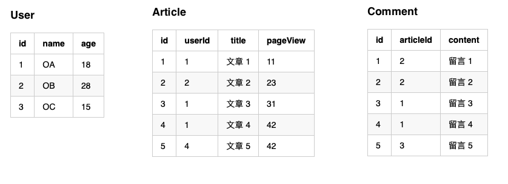

# pre-relation
預先關聯

## 情境
### 資料庫


<!--
### User
| id | name | age |
|---|---|---|
| 1 | OA | 18 |
| 2 | OB | 28 |
| 3 | OC | 15 |

### Article
| id | userId | title | pageView |
|---|---|-------|-----------|
| 1 | 1 | 文章 1 | 11 |
| 2 | 2 | 文章 2 | 23 |
| 3 | 1 | 文章 3 | 31 |
| 4 | 1 | 文章 4 | 42 |
| 5 | 4 | 文章 5 | 42 |

### Comment
| id | articleId | content |
|---|---|-------|-----------|
| 1 | 2 | 留言 1 |
| 2 | 2 | 留言 2 |
| 3 | 1 | 留言 3 |
| 4 | 1 | 留言 4 |
| 5 | 3 | 留言 5 |

-->

### Model

```php
namespace M;

class User extends Model {
  static $relations = [
    'articles' => '<= Article'
  ];
}

class Article extends Model {
  static $relations = [
    'comments' => '<= Comment'
  ];
}

class Comment extends Model {}
```

## 預先關聯

### 理解
使用關聯方式查詢資料庫會增加程式碼的整潔度與可讀性，但在某些情境上要特別注意，在使用**預先關聯**之前，可能需要先了解一下**關聯資料**的基礎原理。

單筆 `User` 下取得其所有 `Article` 的例子而言，程式碼會下兩次 Query 跟資料庫索取資料。

> 這部分可以用 `\M\Model::queryLogger` 開啟檢視 `Query Log`，詳細設定可以參考 [初始設定](00_config.md)。

```php
$user = \M\User::one(1);
foreach ($user->articles as $article) {
  echo $article->title;
  // 依序會印出 "文章 1"、"文章 3"、"文章 4"
}
```

若將 `Query Log` 調閱出來，可以看到分別執行了幾次 Query：

```sql
RAW：SELECT * FROM `User` WHERE id = ? LIMIT 0, 1
VAL：[1]

RAW：SELECT * FROM `Article` WHERE `userId` = ?
VAL：[1]
```

由 `Query Log` 可得知，在執行 `$user = \M\User::one(1);` 時會先產生第一次的 Query，而在讀取 `$user->articles` 時，會下第二次的 Query

### 問題

理解關聯的原理後，思考一下，如果當程式需求為 `多筆 User` 每一筆 `User` 皆要取得其 `Article` 呢？

```php
$users = \M\User::all();
foreach ($users as $user) {
  echo $user->name;

  foreach ($user->articles as $article) {
    echo $article->title;
  }

  // 依序會印出
  // "OA"
  // "文章 1"、"文章 3"、"文章 4"
  // "OB"
  // "文章 2"
  // "OC"
}
```

將 `Query Log` 調閱出來，可以看到分別執行了幾次 Query：

```sql
RAW：SELECT * FROM `User`
VAL：[]

RAW：SELECT * FROM `Article` WHERE `userId` = ?
VAL：[1]

RAW：SELECT * FROM `Article` WHERE `userId` = ?
VAL：[2]

RAW：SELECT * FROM `Article` WHERE `userId` = ?
VAL：[3]
```

由 `Query Log` 可得知，第一個 Query 為 `\M\User::all();` 所產生的，而後三個則為各自的 `User` 在 `$user->articles` 時所產生的 Query！

如此一來當 `User` 有 100 筆資料時，資料庫必然需要執行 1 + 100 次的 Query。

### 解法

理解原理與問題後，就可以使用 **預先關聯** 來解決此問題。因為知道知道取得所有 `User` 之後，會接著取得各個 `User` 各自的 `Article`，所以就可以使用 `pre-relation` 參數來將後面即將執行的 Query 集合起來。

```php
$users = \M\User::all(['pre-relation' => ['articles']]);
foreach ($users as $user) {
  echo $user->name;

  foreach ($user->articles as $article) {
    echo $article->title;
  }

  // 依序會印出
  // "OA"
  // "文章 1"、"文章 3"、"文章 4"
  // "OB"
  // "文章 2"
  // "OC"
}
```

將 `Query Log` 調閱出來，可以看到分別執行了幾次 Query：

```sql
RAW：SELECT * FROM `User`
VAL：[]

RAW：SELECT * FROM `Article` WHERE `userId` IN (?,?,?)
VAL：[1,2,3]
```

由 `Query Log` 可得知，第一個 Query 依然是 `\M\User::all();` 所產生的，而原本後三個改變為使用 `WHERE IN` 的 Query，等取得各自的 `Article`，系統會在將各自的 `Article` 分配回去給各自的 `User`。

如此 Query 就可以由原本的 `N + 1` 縮減到 `2` 個 Query 了，對於資料庫效能上可以解省不少。

## 原理

上述解法有提到，系統是採用 `WHERE IN` 的方式解決迴圈下的關聯所產生的大量 Query，將 `WHERE IN` 所取得的 `Article` 藉由期 `主鍵` 與 `外鍵` 關係分配回去。

試著想像沒有 `pre-relation` 的情境下，你會如何解決 `N + 1` 的 Query 問題？

```php
$users = \M\User::all();

// 取得所有 User ID
$userIds = array_map(function($user) {
  return $user->id;
}, $users);

// 取出這些 User 的所有 Article
$allArticles = \M\Article::all('userId IN (?)', $userIds);

// 以 userId 為 key 組合出各個 User 所屬的 Article
$articles = [];
foreach ($allArticles as $article) {
  if (!isset($articles[$article->userId])) {
    $articles[$article->userId] = [];
  }
  array_push($articles[$article->userId], $article);
}

foreach ($users as $user) {
  echo $user->name;

  // 如果 $articles 內有此 User 的 Article 則取出，沒有則為空陣列
  $userArticles = isset($articles[$user->id]) ? $articles[$user->id] : [];

  foreach ($userArticles as $article) {
    echo $article->title;
  }
  // 依序會印出
  // "OA"
  // "文章 1"、"文章 3"、"文章 4"
  // "OB"
  // "文章 2"
  // "OC"
}
```

將 `Query Log` 調閱出來，可以看到分別執行了幾次 Query：

```sql
RAW：SELECT * FROM `User`
VAL：[]

RAW：SELECT * FROM `Article` WHERE `userId` IN (?,?,?)
VAL：[1,2,3]
```

由 `Query Log` 可以看到也是兩個 Query，這就是針對此問題的正常解法與原理。

先取出所有 `User` 的 `id`，並且藉由這些 `id` 取得其所有 `Article`，再藉由 `Article` 的外鍵 `userId` 來分類 `Article`。

最後在執行每一個 `User` 時，再依依的找出所屬的 Article。

而 `pre-relation` 就是在系統層面就幫你處理完這些複雜的分類問題了。

## 簡寫

預先關聯的關鍵字為 `pre-relation`，其實也可使用 `pre` 替代，如 `\M\User::all(['pre' => ['articles']]);`，而當要預先關聯的 $relations 只有一項時，也可以在簡寫成 `\M\User::all(['pre' => 'articles']);`，上面的範例若用簡寫則如下：

```php
$users = \M\User::all(['pre' => 'articles']);
foreach ($users as $user) {
  echo $user->name;

  foreach ($user->articles as $article) {
    echo $article->title;
  }

  // 依序會印出
  // "OA"
  // "文章 1"、"文章 3"、"文章 4"
  // "OB"
  // "文章 2"
  // "OC"
}
```

## 多階層

如果再多一張 `Comment` 的表需要關聯，其預先關聯寫法就用 `.` 區隔即可，如下範例：

```php
$users = \M\User::all(['pre' => 'articles.comments']);
foreach ($users as $user) {
  echo $user->name;

  foreach ($user->articles as $article) {
    echo $article->title;

    foreach ($article->comments as $comment) {
      echo $comment->content;
    }
  }

  // 依序會印出
  // "OA"
  // "文章 1"、"留言 3"、"留言 4"
  // "文章 3"、"留言 5"
  // "文章 4"

  // "OB"
  // "文章 2"、"留言 1"、"留言 2"
  
  // "OC"
}
```

將 `Query Log` 調閱出來，可以看到分別執行了幾次 Query：

```sql
RAW：SELECT * FROM `User`
VAL：[]

RAW：SELECT * FROM `Article` WHERE `userId` IN (?,?,?)
VAL：[1,2,3]

RAW：SELECT * FROM `Comment` WHERE `articleId` IN (?,?,?,?)
VAL：[1,2,3,4]
```

由 `Query Log` 可以看到一共是 3 個 Query。
